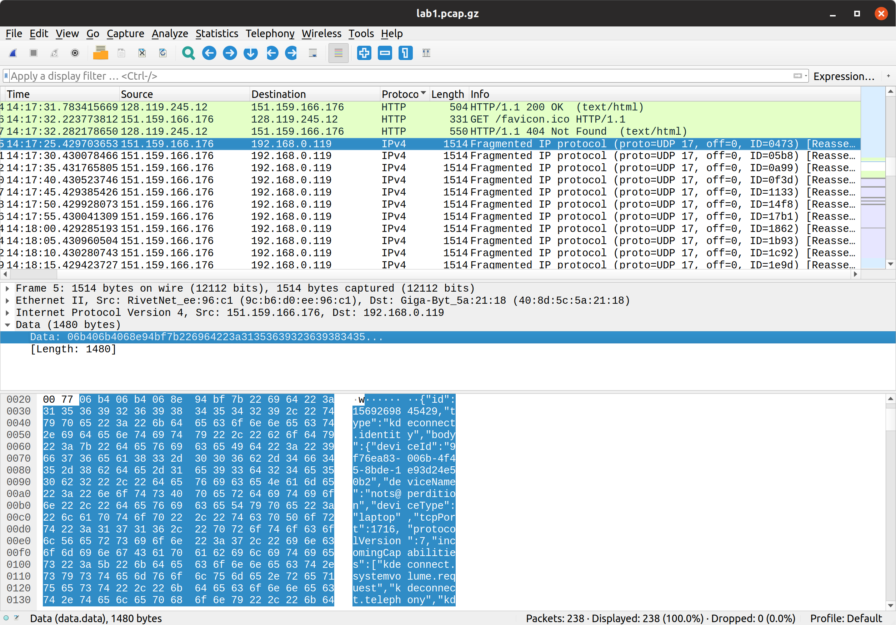
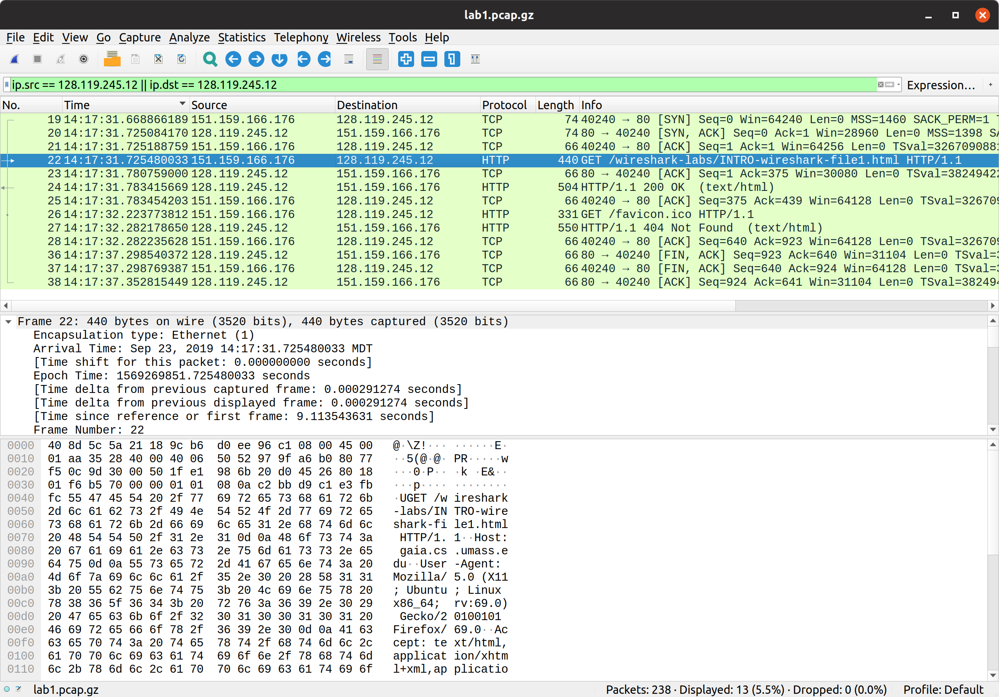
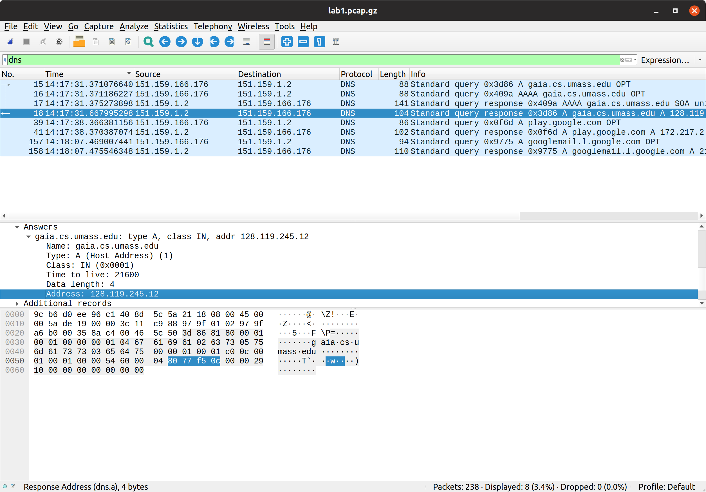

# Networking Lab 1 --- Wireshark Introduction

## Pcap Protocols

The following application and transport protocols were observed during the packet capture window: DHCP, DNS, HTTP, TCP, TLSv1.2, TLSv1.3, UDP, and an unlabeled protocol used by [KDEConnect](https://community.kde.org/KDEConnect).



After further inspection, it appears KDEConnect was attempting to send UDP packets to `192.168.0.119`, which is the IP address of my phone on my home network.
This is odd, because I performed the packet capture on the school `sdsmtopn` network.
It's also interesting that it is transmitting data as unencrypted JSON.

## HTTP Response Times

If we view the entire exchange with the [gaia.cs.umass.edu](gaia.cs.umass.edu) server using the `ip.src == 128.119.245.12 || ip.dst == 128.119.245.12` filter, we can see that the entire exchange lasted almost 6 seconds from the first TCP handshake to the last TCP FIN message.



In particular though, the time delta between the first HTTP request and the HTTP OK response was slightly over 0.05 seconds.

## Gaia IP Address

If we observe the DNS resolution requests to the school's DNS servers for the [gaia.cs.umass.edu](gaia.cs.umass.edu) domain, we can observe its IP address resolved to [128.119.245.12](128.119.245.12).



We can also see from both the DNS exchange and the HTTP exchange above, that my end host's IP address was `151.159.166.176`.

## Transmitted HTTP Messages

The two transmitted HTTP messages are

```text
No.     Time               Source                Destination           Protocol Length Info
     22 14:17:31.725480033 151.159.166.176       128.119.245.12        HTTP     440    GET /wireshark-labs/INTRO-wireshark-file1.html HTTP/1.1

Frame 22: 440 bytes on wire (3520 bits), 440 bytes captured (3520 bits)
Ethernet II, Src: RivetNet_ee:96:c1 (9c:b6:d0:ee:96:c1), Dst: Giga-Byt_5a:21:18 (40:8d:5c:5a:21:18)
Internet Protocol Version 4, Src: 151.159.166.176, Dst: 128.119.245.12
Transmission Control Protocol, Src Port: 40240, Dst Port: 80, Seq: 1, Ack: 1, Len: 374
Hypertext Transfer Protocol
    GET /wireshark-labs/INTRO-wireshark-file1.html HTTP/1.1\r\n
    Host: gaia.cs.umass.edu\r\n
    User-Agent: Mozilla/5.0 (X11; Ubuntu; Linux x86_64; rv:69.0) Gecko/20100101 Firefox/69.0\r\n
    Accept: text/html,application/xhtml+xml,application/xml;q=0.9,*/*;q=0.8\r\n
    Accept-Language: en-US,en;q=0.5\r\n
    Accept-Encoding: gzip, deflate\r\n
    DNT: 1\r\n
    Connection: keep-alive\r\n
    Upgrade-Insecure-Requests: 1\r\n
    \r\n
    [Full request URI: http://gaia.cs.umass.edu/wireshark-labs/INTRO-wireshark-file1.html]
    [HTTP request 1/2]
    [Response in frame: 24]
    [Next request in frame: 26]
```

and

```text
No.     Time               Source                Destination           Protocol Length Info
     24 14:17:31.783415669 128.119.245.12        151.159.166.176       HTTP     504    HTTP/1.1 200 OK  (text/html)

Frame 24: 504 bytes on wire (4032 bits), 504 bytes captured (4032 bits)
Ethernet II, Src: Giga-Byt_5a:21:18 (40:8d:5c:5a:21:18), Dst: RivetNet_ee:96:c1 (9c:b6:d0:ee:96:c1)
Internet Protocol Version 4, Src: 128.119.245.12, Dst: 151.159.166.176
Transmission Control Protocol, Src Port: 80, Dst Port: 40240, Seq: 1, Ack: 375, Len: 438
Hypertext Transfer Protocol
    HTTP/1.1 200 OK\r\n
    Date: Mon, 23 Sep 2019 20:17:31 GMT\r\n
    Server: Apache/2.4.6 (CentOS) OpenSSL/1.0.2k-fips PHP/5.4.16 mod_perl/2.0.10 Perl/v5.16.3\r\n
    Last-Modified: Mon, 23 Sep 2019 05:59:01 GMT\r\n
    ETag: "51-593321dccd719"\r\n
    Accept-Ranges: bytes\r\n
    Content-Length: 81\r\n
    Keep-Alive: timeout=5, max=100\r\n
    Connection: Keep-Alive\r\n
    Content-Type: text/html; charset=UTF-8\r\n
    \r\n
    [HTTP response 1/2]
    [Time since request: 0.057935636 seconds]
    [Request in frame: 22]
    [Next request in frame: 26]
    [Next response in frame: 27]
    [Request URI: http://gaia.cs.umass.edu/wireshark-labs/INTRO-wireshark-file1.html]
    File Data: 81 bytes
Line-based text data: text/html (3 lines)
    <html>\n
    Congratulations!  You've downloaded the first Wireshark lab file!\n
    </html>\n
```

Notice that the `Time since request` field verifies the time delta between the initial request and the response discussed above.
