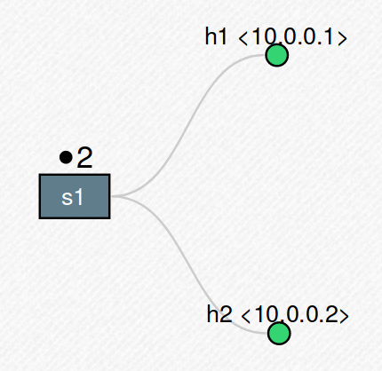
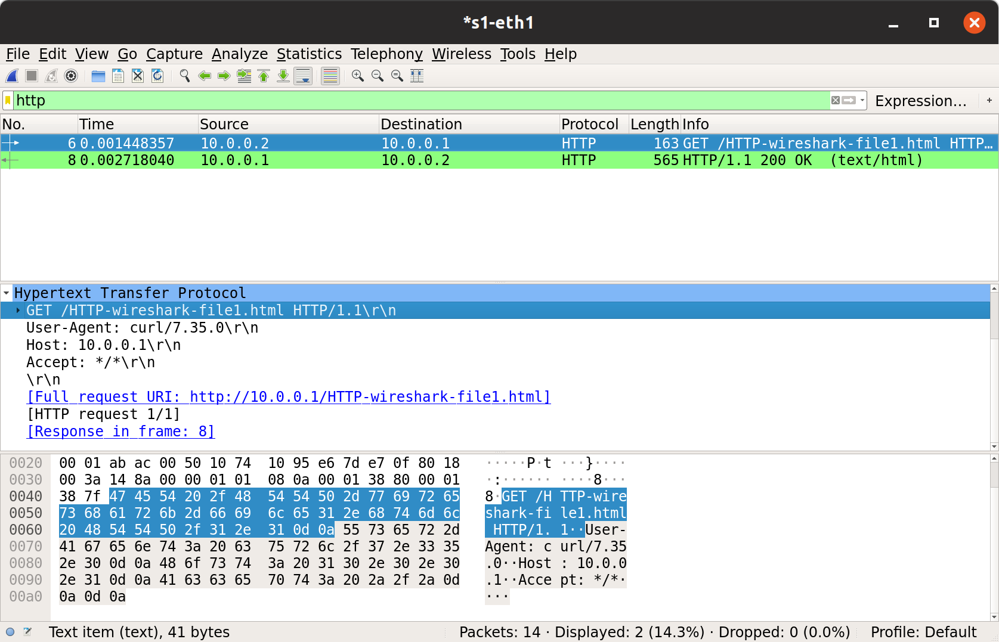
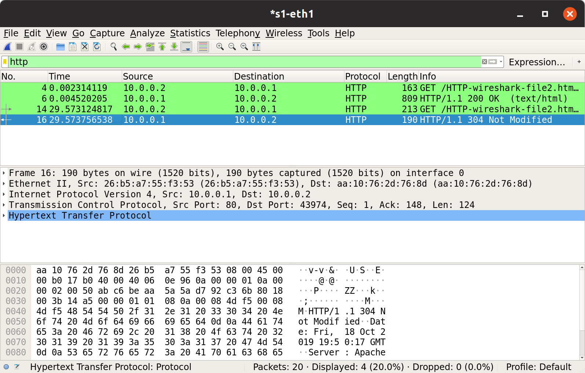

# Networking Lab 2 --- HTTP Conditional-Get

- [Networking Lab 2 --- HTTP Conditional-Get](#networking-lab-2-----http-conditional-get)

# Mininet Setup

We use the default Mininet topology with no configuration.



We run an Apache2 webserver from the first host (`h1` at `10.0.0.1`), and request the files from the second host.

# Basic HTTP Request/Response Interaction

By X11 session-forwarding, we can run Wireshark on the Mininet VM and interact with it on our host machine.
Note that Wireshark was completely unresponsive to user input through the X-forwarding until I upgraded the version of Wireshark running on the Mininet VM.

So from the second host, we request a file from the first host's webserver.

```shell
mininet> h2 curl -o - http://10.0.0.1/HTTP-wireshark-file1.html
<html><head><meta http-equiv="Content-Type" content="text/html; charset=UTF-8"></head><body class=" hasGoogleVoiceExt">Congratulations.  Youve downloaded the file
http://www.mcs.sdsmt.edu/mqia/csc441/Lab2/HTTP-wireshark-file1.html!

</body></html>

mininet>
```

By running Wireshark at the same time we download the requested file, we can view the HTTP request and response.



We then export the packet capture as plaintext.
The following is the HTTP request `curl` sent to the webserver.

```text
No.     Time           Source                Destination           Protocol Length Info
      6 0.001448357    10.0.0.2              10.0.0.1              HTTP     163    GET /HTTP-wireshark-file1.html HTTP/1.1

Hypertext Transfer Protocol
    GET /HTTP-wireshark-file1.html HTTP/1.1\r\n
        [Expert Info (Chat/Sequence): GET /HTTP-wireshark-file1.html HTTP/1.1\r\n]
            [GET /HTTP-wireshark-file1.html HTTP/1.1\r\n]
            [Severity level: Chat]
            [Group: Sequence]
        Request Method: GET
        Request URI: /HTTP-wireshark-file1.html
        Request Version: HTTP/1.1
    User-Agent: curl/7.35.0\r\n
    Host: 10.0.0.1\r\n
    Accept: */*\r\n
    \r\n
    [Full request URI: http://10.0.0.1/HTTP-wireshark-file1.html]
    [HTTP request 1/1]
    [Response in frame: 8]
```

Apache2 responded with the following HTTP response.

```text
No.     Time           Source                Destination           Protocol Length Info
      8 0.002718040    10.0.0.1              10.0.0.2              HTTP     565    HTTP/1.1 200 OK  (text/html)

Hypertext Transfer Protocol
    HTTP/1.1 200 OK\r\n
        [Expert Info (Chat/Sequence): HTTP/1.1 200 OK\r\n]
            [HTTP/1.1 200 OK\r\n]
            [Severity level: Chat]
            [Group: Sequence]
        Response Version: HTTP/1.1
        Status Code: 200
        [Status Code Description: OK]
        Response Phrase: OK
    Date: Fri, 18 Oct 2019 19:19:20 GMT\r\n
    Server: Apache/2.4.7 (Ubuntu)\r\n
    Last-Modified: Fri, 11 Oct 2019 18:11:33 GMT\r\n
    ETag: "f9-594a672b60d93"\r\n
    Accept-Ranges: bytes\r\n
    Content-Length: 249\r\n
        [Content length: 249]
    Vary: Accept-Encoding\r\n
    Content-Type: text/html\r\n
    \r\n
    [HTTP response 1/1]
    [Time since request: 0.001269683 seconds]
    [Request in frame: 6]
    File Data: 249 bytes
Line-based text data: text/html (4 lines)
    <html><head><meta http-equiv="Content-Type" content="text/html; charset=UTF-8"></head><body class=" hasGoogleVoiceExt">Congratulations.  You've downloaded the file \n
    http://www.mcs.sdsmt.edu/mqia/csc441/Lab2/HTTP-wireshark-file1.html!\n
    \n
    </body></html>
```

From this information, we answer the following questions.

1. Is your browser running HTTP version 1.0 or 1.1?

   There are no browsers involved. Curl used HTTP/1.1 to request the file.

   ```text
   Request URI: /HTTP-wireshark-file1.html
   Request Version: HTTP/1.1
   User-Agent: curl/7.35.0\r\n
   ```

2. What version of HTTP is the server running?

   The Apache web server responded with an HTTP/1.1 response.

   ```text
   Response Version: HTTP/1.1
   Status Code: 200
   Response Phrase: OK
   Server: Apache/2.4.7 (Ubuntu)\r\n
   ```

3. What is the status code returned to the client from the server?

   As the above snippet indicates, the status code was 200 (OK).

4. When was the HTML file that you are retrieving last modified at the server?

   The file was last modified October 11th, at 6pm GMT.

   ```text
   Date: Fri, 18 Oct 2019 19:19:20 GMT\r\n
   Server: Apache/2.4.7 (Ubuntu)\r\n
   Last-Modified: Fri, 11 Oct 2019 18:11:33 GMT\r\n
   ```

5. How many bytes of HTTP content are being returned to the client?

   The response body is 249 bytes long.

   ```text
   Content-Length: 249\r\n
   ```

# HTTP Conditional-Get Requests

Here, we download a file

```shell
mininet> h2 curl -o - http://10.0.0.1/HTTP-wireshark-file2.html
<html><head><meta http-equiv="Content-Type" content="text/html; charset=UTF-8"></head><body class=" hasGoogleVoiceExt">Congratulations again!  Now you've downloaded the file lab2-2.html. <br>
This file's last modification date will not change.  <p>
Thus  if you download this multiple times on your browser, a complete copy <br>
will only be sent once by the server due to the inclusion of the IN-MODIFIED-SINCE<br>
field in your browser's HTTP GET request to the server.


</p></body></html>
mininet>
```

and then attempt to download it again using a conditional GET request.

```shell
mininet> h2 curl -z 2019.Oct.12 -o - http://10.0.0.1/HTTP-wireshark-file2.html
mininet>
```

Wireshark shows the following packets



which we use to answer the following questsions.

1. Inspect the contents of the first HTTP GET request from your browser to the server.  Do you see an “IF-MODIFIED-SINCE” line in the HTTP GET?

   No.

   ```text
   No.     Time           Source                Destination           Protocol Length Info
         4 0.002314119    10.0.0.2              10.0.0.1              HTTP     163    GET /HTTP-wireshark-file2.html HTTP/1.1

   Hypertext Transfer Protocol
       GET /HTTP-wireshark-file2.html HTTP/1.1\r\n
           [Expert Info (Chat/Sequence): GET /HTTP-wireshark-file2.html HTTP/1.1\r\n]
               [GET /HTTP-wireshark-file2.html HTTP/1.1\r\n]
               [Severity level: Chat]
               [Group: Sequence]
           Request Method: GET
           Request URI: /HTTP-wireshark-file2.html
           Request Version: HTTP/1.1
       User-Agent: curl/7.35.0\r\n
       Host: 10.0.0.1\r\n
       Accept: */*\r\n
       \r\n
       [Full request URI: http://10.0.0.1/HTTP-wireshark-file2.html]
       [HTTP request 1/1]
       [Response in frame: 6]
   ```

2. Inspect the contents of the server response. Did the server explicitly return the contents of the file?   How can you tell?

   Yes, observe the contents of the HTML file in the response.

   ```text
   No.     Time           Source                Destination           Protocol Length Info
         6 0.004520205    10.0.0.1              10.0.0.2              HTTP     809    HTTP/1.1 200 OK  (text/html)

   Hypertext Transfer Protocol
       HTTP/1.1 200 OK\r\n
           [Expert Info (Chat/Sequence): HTTP/1.1 200 OK\r\n]
               [HTTP/1.1 200 OK\r\n]
               [Severity level: Chat]
               [Group: Sequence]
           Response Version: HTTP/1.1
           Status Code: 200
           [Status Code Description: OK]
           Response Phrase: OK
       Date: Fri, 18 Oct 2019 19:49:47 GMT\r\n
       Server: Apache/2.4.7 (Ubuntu)\r\n
       Last-Modified: Fri, 11 Oct 2019 18:11:33 GMT\r\n
       ETag: "1ec-594a672b60d93"\r\n
       Accept-Ranges: bytes\r\n
       Content-Length: 492\r\n
           [Content length: 492]
       Vary: Accept-Encoding\r\n
       Content-Type: text/html\r\n
       \r\n
       [HTTP response 1/1]
       [Time since request: 0.002206086 seconds]
       [Request in frame: 4]
       File Data: 492 bytes
   Line-based text data: text/html (8 lines)
       <html><head><meta http-equiv="Content-Type" content="text/html; charset=UTF-8"></head><body class=" hasGoogleVoiceExt">Congratulations again!  Now you've downloaded the file lab2-2.html. <br>\n
       This file's last modification date will not change.  <p>\n
       Thus  if you download this multiple times on your browser, a complete copy <br>\n
       will only be sent once by the server due to the inclusion of the IN-MODIFIED-SINCE<br>\n
       field in your browser's HTTP GET request to the server.\n
       \n
       \n
       </p></body></html>
   ```

3. Now inspect the contents of the second HTTP GET request from your browser to the server.  Do you see an “IF-MODIFIED-SINCE:” line in the HTTP GET? If so, what information follows the “IF-MODIFIED-SINCE:” header?

   Yes, there is an `If-Modified-Since` header in the second request:

   ```text
   No.     Time           Source                Destination           Protocol Length Info
     14 29.573124817   10.0.0.2              10.0.0.1              HTTP     213    GET /   HTTP-wireshark-file2.html HTTP/1.1

   Hypertext Transfer Protocol
       GET /HTTP-wireshark-file2.html HTTP/1.1\r\n
           [Expert Info (Chat/Sequence): GET /HTTP-wireshark-file2.html HTTP/1.1\r\n]
               [GET /HTTP-wireshark-file2.html HTTP/1.1\r\n]
               [Severity level: Chat]
               [Group: Sequence]
           Request Method: GET
           Request URI: /HTTP-wireshark-file2.html
           Request Version: HTTP/1.1
       User-Agent: curl/7.35.0\r\n
       Host: 10.0.0.1\r\n
       Accept: */*\r\n
       If-Modified-Since: Sat, 12 Oct 2019 00:00:00 GMT\r\n
       \r\n
       [Full request URI: http://10.0.0.1/HTTP-wireshark-file2.html]
       [HTTP request 1/1]
       [Response in frame: 16]
   ```

   The header value is the date passed to the Curl command used to request the file:

   ```text
   If-Modified-Since: Sat, 12 Oct 2019 00:00:00 GMT\r\n
   ```

4. What is the HTTP status code and phrase returned from the server in response to this second HTTP GET?

   The response status was 304 (Not Modified).

   ```text
   No.     Time           Source                Destination           Protocol Length Info
     16 29.573756538   10.0.0.1              10.0.0.2              HTTP     190    HTTP/   1.1 304 Not Modified

   Hypertext Transfer Protocol
       HTTP/1.1 304 Not Modified\r\n
           [Expert Info (Chat/Sequence): HTTP/1.1 304 Not Modified\r\n]
               [HTTP/1.1 304 Not Modified\r\n]
               [Severity level: Chat]
               [Group: Sequence]
           Response Version: HTTP/1.1
           Status Code: 304
           [Status Code Description: Not Modified]
           Response Phrase: Not Modified
       Date: Fri, 18 Oct 2019 19:50:17 GMT\r\n
       Server: Apache/2.4.7 (Ubuntu)\r\n
       ETag: "1ec-594a672b60d93"\r\n
       \r\n
       [HTTP response 1/1]
       [Time since request: 0.000631721 seconds]
       [Request in frame: 14]
   ```

5. Did the server explicitly return the contents of the file? Explain.

   No, the server did not return the contents of the file in the response.
   The body was empty, and no content was given.
