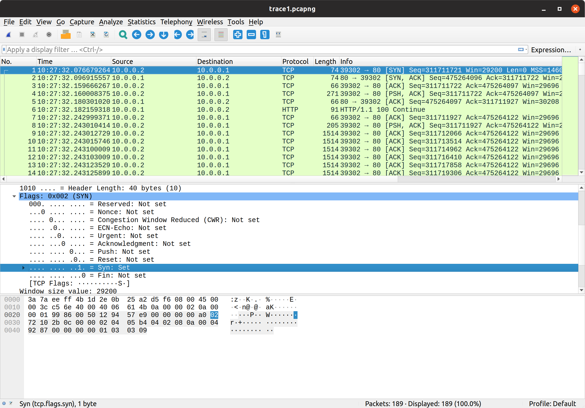
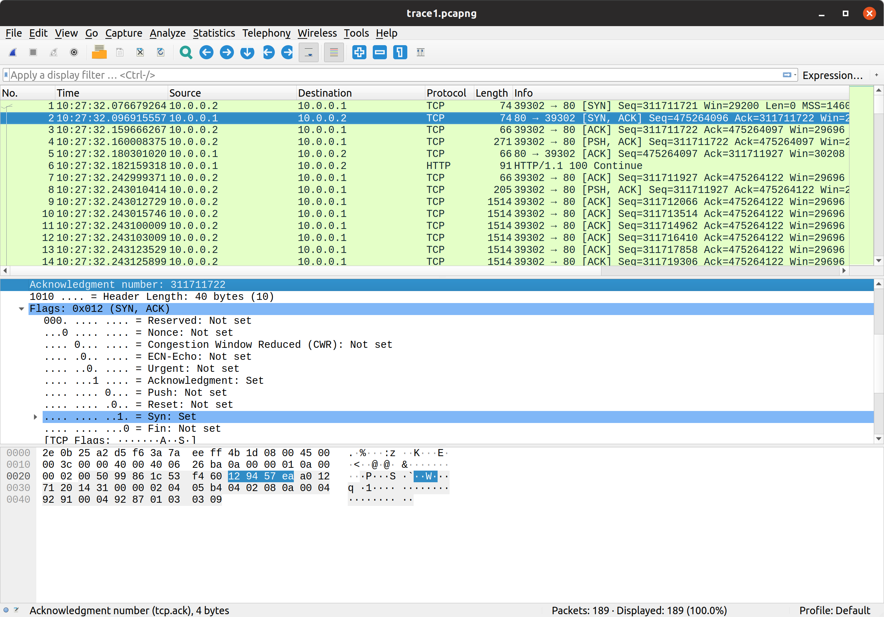
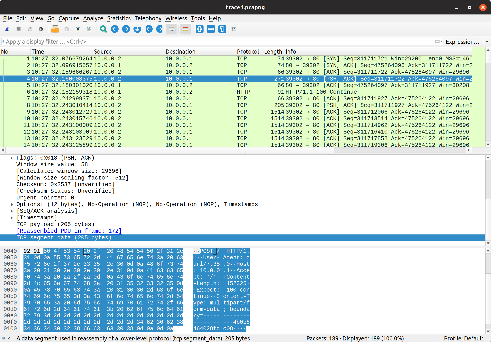
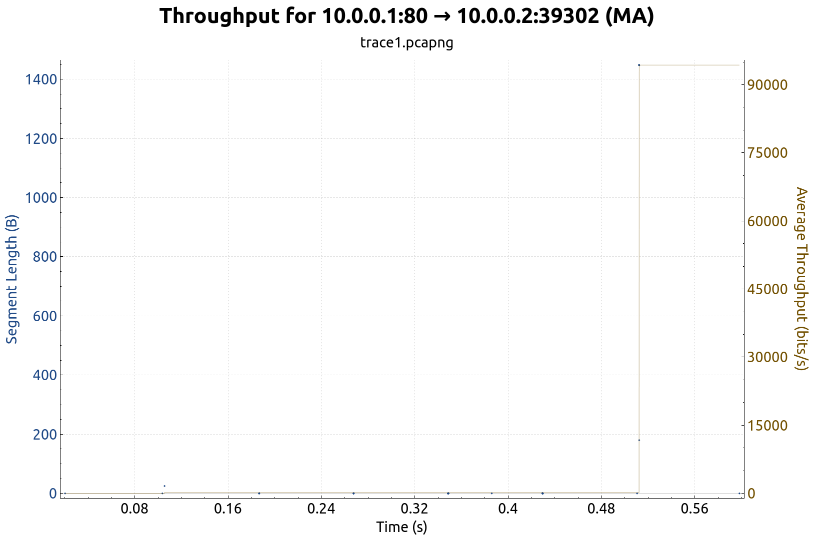
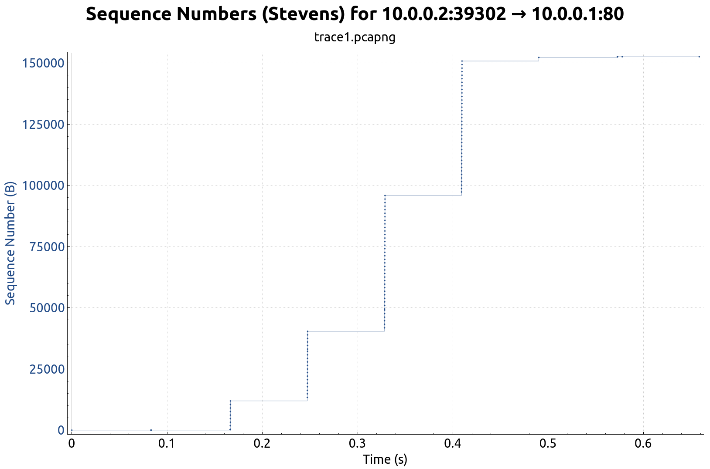
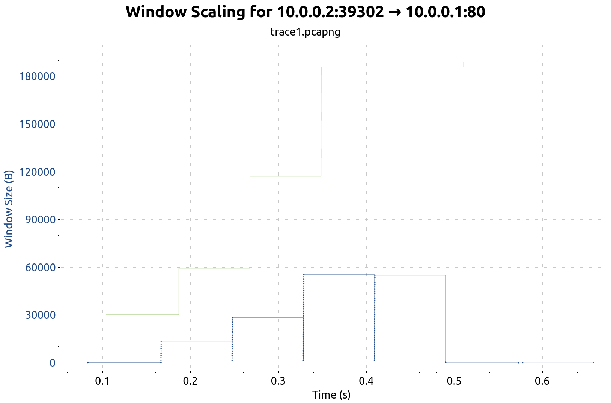
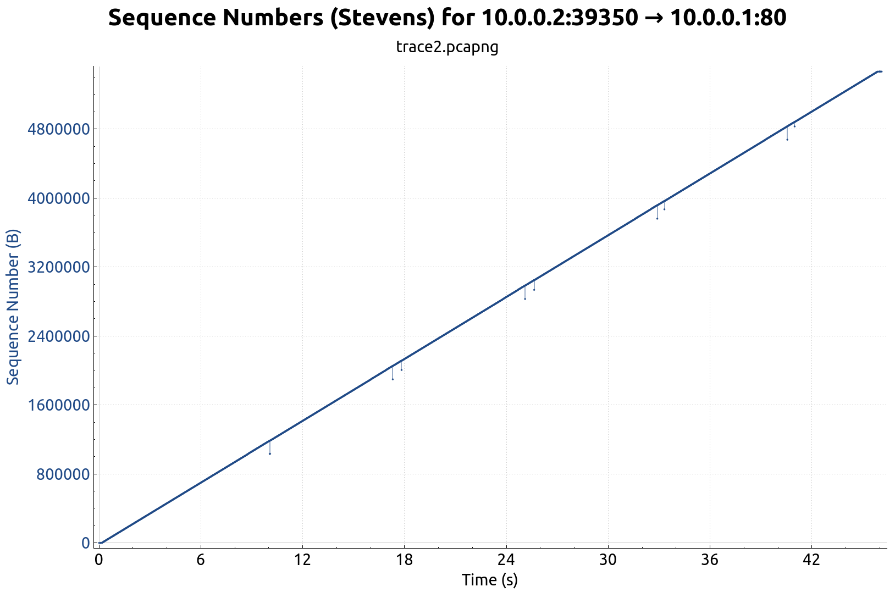
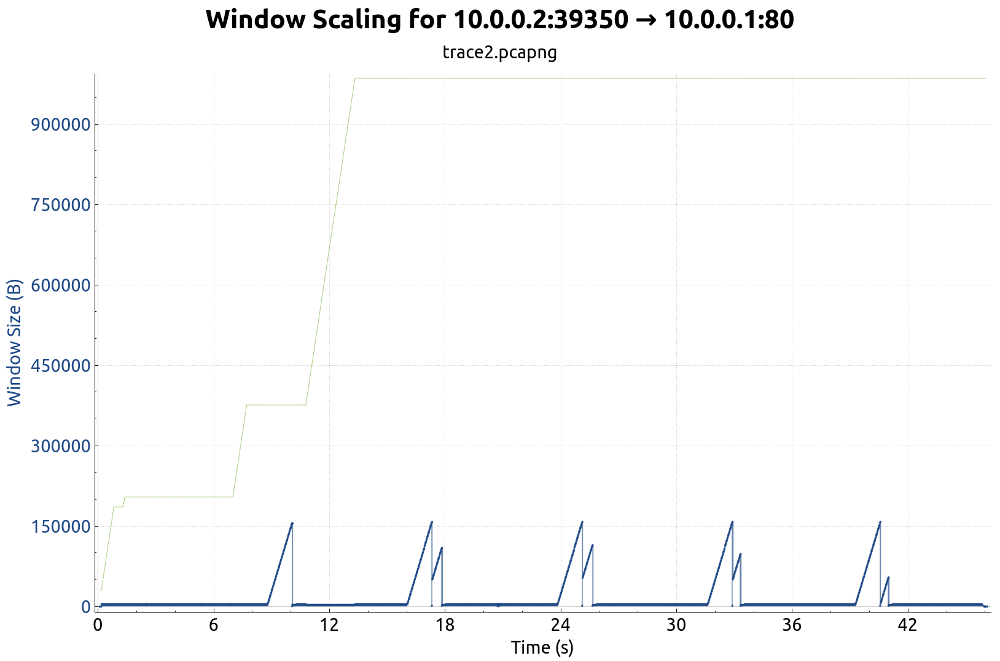

# Networking Lab 3 --- TCP

* [Experiment 1](#experiment-1)
* [Experiment 2](#experiment-2)
* [TCP Basics](#tcp-basics)
* [TCP Congestion Control](#tcp-congestion-control)
  * [Experiment 1](#experiment-1-1)
  * [Experiment 2](#experiment-2-1)

## Experiment 1

First, the lab files were downloaded to the Mininet VM

```shell
$ mkdir lab3
$ wget -r -np -R "index.html*" https://www.cse.sdsmt.edu/mqia/csc441/Lab3/
$ mv www.cse.sdsmt.edu/mqia/csc441/Lab3/* lab3
$ rm -rf www.cse.sdsmt.edu/mqia/csc441/Lab3/
```

Then run the following Python script to setup the Mininet network.
Node that the script must be ran as root.

```python
#!/usr/bin/python
from __future__ import print_function
from mininet.topo import Topo
from mininet.net import Mininet
from mininet.node import CPULimitedHost
from mininet.link import TCLink
from mininet.util import dumpNodeConnections
from mininet.log import setLogLevel
from mininet.cli import CLI

class SingleSwitchTopo(Topo):
    """Single switch connected to n hosts."""

    def build( self, n=2 ):
        switch = self.addSwitch('s1')
        h1 = self.addHost('h1')
        h2 = self.addHost('h2')
        self.addLink( h1, switch, bw=1000, delay='20ms', max_queue_size=10000)
        self.addLink( h2, switch, bw=1000, delay='20ms', max_queue_size=10000)

if __name__ == '__main__':
    # Tell mininet to print useful information
    setLogLevel('info')
    topo = SingleSwitchTopo(n=2)
    net = Mininet(topo=topo, host=CPULimitedHost, link=TCLink)
    net.start()
    h1 = net.getNodeByName('h1')
    h2 = net.getNodeByName('h2')
    h1.cmd('ethtool -K h1-eth0 tso off gso off')
    h2.cmd('ethtool -K h2-eth0 tso off gso off')
    print("Dumping host connections")
    dumpNodeConnections(net.hosts)
    print("Testing network connectivity")
    net.pingAll()
    CLI(net)
```

Start the Apache web server on host `h1` inside the Mininet shell

```shell
mininet> h1 service apache2 restart
```

In another X11-forwarded SSH session, run Wireshark and capture traffic on the `s1-eth1` interface.
Note that since Wireshark is not being started inside the Mininet shell, it must be ran as root, because the default Mininet installation settings do not allow running it as a user (the standard installation method).

From the Mininet shell, run the command

```shell
mininet> h2 curl -F 'data=@/home/mininet/lab3/alice.txt' http://10.0.0.1
```

then stop and save the packet capture, and transfer it to the host OS for analysis.
This `curl` invocation uses the `--form` flag to POST the contents of the `~/lab3/alice.txt` file to the Apache webserver.

## Experiment 2

Repeat the above experiment, but with diminished bandwidth for host `h1`.
Reduce `h1`'s bandwidth by editing `mytopo.py`:

```python
self.addLink(h1, switch, bw=1, delay='20ms', max_queue_size=100)
self.addLink(h2, switch, bw=1000, delay='20ms', max_queue_size=10000)
```

```shell
$ sudo python mytopo.py
mininet> h1 service apache2 restart
mininet> h2 curl -F 'data=@/home/mininet/lab3/shakespeare.txt' http://10.0.0.1
```

---

## TCP Basics

The following questions are answered using the packet capture from the first experiment.

1. What is the sequence number of the TCP SYN segment used to initiate the TCP connection between the client computer and the server?

   Refer to the following figure.

   

   The sequence number for the first SYN segment is `311711721`.
2. What in the segment identifies it as a SYN segment?

   The SYN flag in the TCP header is set.
3. What is the sequence number of the SYNACK sent in response by the server?

   Refer to the following figure.

   

   The sequence number is `475264096`.
4. What is the value of the Acknowledgement field in the SYNACK segment?

   The acknowledgement value is `311711722`.
5. How did the webserver on host `h1` determine that value?

   The acknowledgement value is the byte *after* the sequence number of the segment the server is acknowledging.
6. What in the segment identifies it as a SYNACK segment?

   The SYN *and* ACK flags are set in the TCP header.
7. What is the sequence number of the TCP segment containing the HTTP POST command?

   Refer to the following figure.

   

   The sequence number is `311711722`.
8. Consider the TCP segment containing the HTTP POST as the first segment in the TCP connection
   1. What are the sequence numbers of the first six segments in the TCP connection?
   2. At what time was each segment sent?
   3. When was the ACK for each segment received?
   4. What is the RTT value for each segment?
   5. What is the `EstimatedRTT` value for each segment? Use the equation

      `EstimatedRTT = 0.875 * EstimatedRTT + 0.125 * SampleRTT`

   | Packet | Seq. No.  | Sent Time          | ACK Recv Time      | RTT (sec)   | EstimatedRTT | Length |
   | ------ | --------- | ------------------ | ------------------ | ----------- | ------------ | ------ |
   |      4 | 311711722 | 10:27:32.160008375 | 10:27:32.180301020 | 0.020292645 | 0.020292645  | 205    |
   |      8 | 311711927 | 10:27:32.243010414 |                    | 0.020239673 | 0.020286023  | 139    |
   |      9 | 311712066 | 10:27:32.243012729 | 10:27:32.263250087 | 0.020237358 | 0.020279940  | 1448   |
   |     10 | 311713514 | 10:27:32.243015746 |                    | 0.020235867 | 0.020274431  | 1448   |
   |     11 | 311714962 | 10:27:32.243100009 | 10:27:32.263251613 | 0.020151604 | 0.020259078  | 1448   |
   |     12 | 311716410 | 10:27:32.243103009 |                    | ~0.0202     | 0.020251693  | 1448   |

   Notice that the server only ACKd frames 4, 9, and 11.
   Apparently this is a space-saving measure where ACKs acknowledge *two* segments at a time.
   The following Python snippet was used to calculate the estimated RTTs.

   ```python
   >>> rtts = [0.020292645, 0.020239673, 0.020237358, 0.020235867, 0.020151604, 0.0202]
   >>> ertt = rtts[0]
   >>> for rtt in rtts:
           ertt = 0.875 * ertt + 0.125 * rtt
           print('rtt:', rtt, '\tertt:', ertt)
   rtt: 0.020292645 ertt: 0.020292645
   rtt: 0.020239673 ertt: 0.0202860235
   rtt: 0.020237358 ertt: 0.0202799403125
   rtt: 0.020235867 ertt: 0.0202744311484375
   rtt: 0.020151604 ertt: 0.020259077754882813
   rtt: 0.0202      ertt: 0.02025169303552246
   ```

9. What is the minimum amount of available buffer space advertised at the received for the entire trace? Does the lack of receiver buffer space ever throttle the sender?

   The minimum window size value for the server is 59, with a window scaling factor of 512 set in the three-way SYN handshake.
   This makes the effective minimum window size 30208 bytes.
10. Are there any retransmitted segments in the packet capture? Why?

    No, there are no retransmissions.
    At no point was a packet dropped, because the network was not operating at full capacity.
11. How much data does the receiver typically acknowledge in an ACK?

    | Packet No. | ACK No.   | ACK Size |
    |------------|-----------|----------|
    |         18 | 311713514 | 1587     |
    |         19 | 311716410 | 2896     |
    |         20 | 311719306 | 2896     |
    |         21 | 311722202 | 2896     |
    |         22 | 311725098 | 2896     |
    |         43 | 311727994 | 2896     |
    |         44 | 311730890 | 2896     |
    |         45 | 311733786 | 2896     |
    |         46 | 311736682 | 2896     |
12. Can you identify cases where the receiver is ACKing multiple segments?

    Yes, every ACK acknowledges two segments (1448 bytes each, except for the segments used to initiate the TCP connection).
13. What is the average throughput for the TCP connection?

    The following graph was generated by Wireshark via the `Statistics > TCP Stream Graphs > Throughput` menu.
    It indicates that the average throughput was on the order of 94 Kbps.

    

## TCP Congestion Control

The following questions are answered using the packet captures from both experiments.

### Experiment 1

Consider the following Stevens graph for the first experiment.



1. How much data at maximum is sent in the pipelined method without receiving ACKs?

   Through visual inspection of the plot, the largest contiguous chunk of TCP segments sent without ACKs was frames 112 through 149 (Sequence numbers 311809002 through 311862498).
   This forms 53496 bytes of data (excluding the IP and Ethernet headers).
2. Was the transmission illustrated in the graph throttled by the congestion avoidance? Why?

   No. Each transmitted window of unACKd segments steadily increases until the last few segments used to conclude the connection.

   We can also look at an explicit plot of the window size to glean the same information:

   

### Experiment 2

Consider the following Stevens plot for the second experiment.



and the plot of the explicit window size



1. How much data at maximum is sent in the pipelined method without receiving ACKs?

   The maximum window size ocurred from frames 1080 through 1290 (sequences 755778426 through 755931914), with a size of 153488 bytes.
2. Was the transmission illustrated in the graph throttled by the congestion avoidance? Why?

   Yes. The plot of the window size shows this clearly.

The reason the max window size for the second experiment is so much larger than for the first is because the amount of data transmitted is an order and a half magnitude larger (5MB vs 150KB).
This means that the transmission actually had a chance to saturate the connection between the two hosts to the point that a segment was dropped.
Notice that the maximum segment size for the second experiment is *larger* than the total size of the `Alice.txt` file being transferred.
