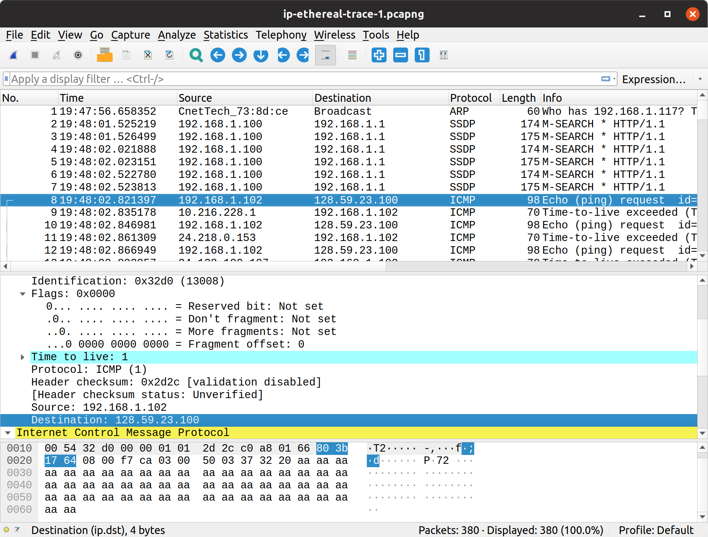
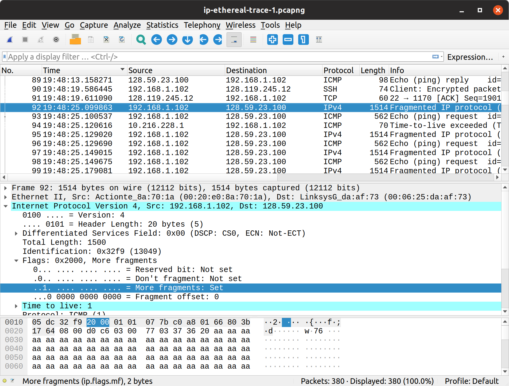
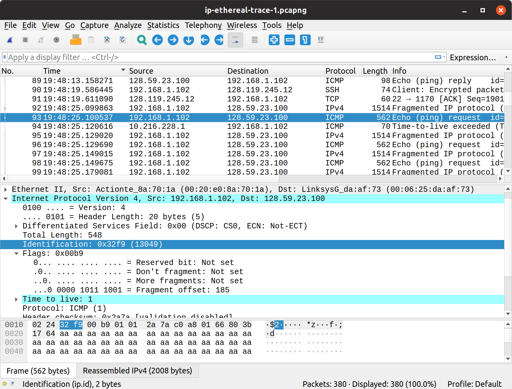
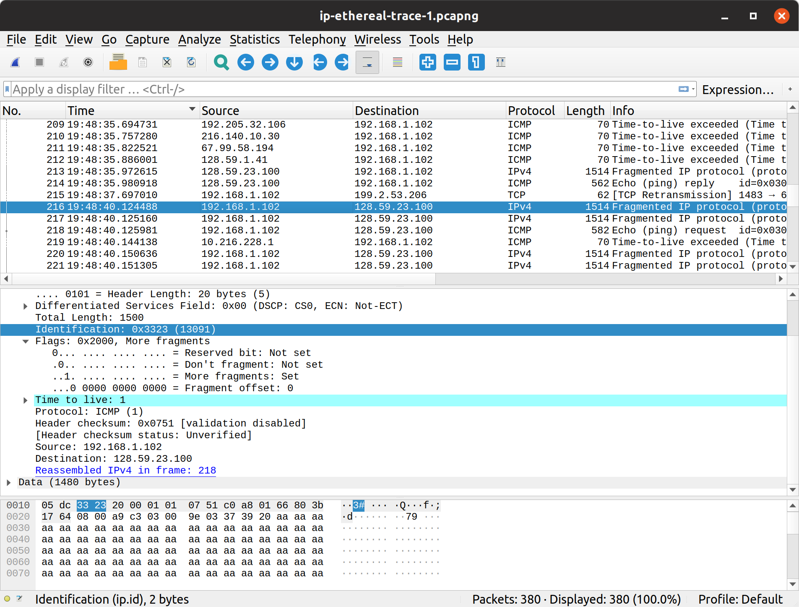

# Networking Lab 4 --- IP

There was no setup or experimentation for this lab.
The following questions were answered using the [`ip-ethereal-trace-1.pcapng`](https://www.cse.sdsmt.edu/mqia/csc441/Lab4/ip-ethereal-trace-1.pcapng) packet capture from the course website.

## ICMP Echo

Refer to the following figure.

1. The destination IP address is 128.59.23.100.
2. The protocol field has the value `0x01`, which corresponds to ICMP.
3. The header length is 20 bytes. The ICMP data is 56 bytes, plus an 8 byte ICMP header. This agrees with the 84 total bytes indicated in the IP header.
4. No the fragmentation flags have not been set.
5. The Identification, TTL, and checksum fields always change.
6. The identification field increments by one for each unfragmented datagram; fragmented datagrams all share the same ID. The source and destination fields must stay constant, as should the rest of the fields.
7. The TTL-Exceeded responses from the nearest host have a constant `255` TTL, but unlike the rest of the responses the ID changes per response. For all of the other hops along the way, however, the ID has a constant `0x0000` value.
8. I do not understand why the first hop is special. I would have expected *all* of the TTL-Exceeded responses to have unique IDs, because the ID is used to reassemble fragmented datagrams.

## Fragmentation

1. Yes, the packet was split into `1500`-byte and `548`-byte fragments respectively.
2. The first packet was indicated to have been fragmented by the More Fragments flag in the header. It was indicated to have been the first fragment of the original datagram by having a `0` Fragment Offset.
3. The second fragment has the same ID as the first, and has a non-zero Fragment Offset value. This indicates that it is a continuation of the previous fragment. Additionally, it does not have the More Fragments flag set, so we know that it is the last fragment of the original datagram.
4. The packet length, flags, and checksum change between the fragments.

1. Three fragments with the ID `0x3323` were created.
2. The fragment offset, data length, and checksum all change between the fragments, as expected.
