# Program 1 - HTTP Server

The goal of this project is to demonstrate understanding of sockets and their use in an HTTP server.

- [Design Overview](#design-overview)
  - [Commandline Usage](#commandline-usage)
  - [Server Architecture](#server-architecture)
- [Screenshots](#screenshots)
  - [Webroot Contents](#webroot-contents)
  - [Basic Functionality](#basic-functionality)
  - [Serving Directory Index Pages](#serving-directory-index-pages)
  - [Autogenerated Index Pages](#autogenerated-index-pages)
  - [Content MIME-Types](#content-mime-types)
  - [Filenames with Spaces](#filenames-with-spaces)

# Design Overview

While including a listing of the entire project is unreasonable, here we discuss the important aspects of this implementation.

## Commandline Usage

Running `./httpserver.py --help` will display the following help screen.

```text
$ ./httpserver.py --help
usage: httpserver.py [-h] [--port PORT] [--host HOST] [--webroot WEBROOT]
                     [--threads THREADS] [--connections CONNECTIONS]
                     [--verbose]

A simple HTTP server demonstrating basic understanding of sockets and HTTP.

optional arguments:
  -h, --help            show this help message and exit
  --port PORT, -p PORT  The port to listen on.
  --host HOST, -l HOST  The address to bind to.
  --webroot WEBROOT     The server root directory to serve content from.
  --threads THREADS, -t THREADS
                        Number of HTTP request handler threads.
  --connections CONNECTIONS
                        The maximum number of connections to allow.
  --verbose, -v         Increase output verbosity.
```

As you can see, there are a number of parameters that can be tweaked.
Most importantly, the port to listen on, and the webroot can easily be modified.

Notice also that this is a multithreaded program, and will attempt to handle HTTP requests with as many threads as you specify.
However, realize that threading in Python is limited due to the existence of the [Global Interpreter Lock](https://docs.python.org/3/library/threading.html) (GIL) in the CPython reference implementation (and several others).
The implication is that only one thread can execute at a time.
Thus for performance critical tasks, the reccommendation is to use the `multiprocessing` library instead.
However, using threads is still applicable for I/O-bound tasks (like an HTTP server!)

## Server Architecture

The HTTP requests are received serially on the configured port from the commandline parameters, but are then placed in a queue for the request handler threads to consume at their convenience.

The following snippet shows how accept each request.

```python
def run(self):
    """Run the HTTP listener in the background."""
    while not self.is_canceled:
        connection, address = self.socket.accept()
        # Recv the data from the socket in another thread to avoid
        # blocking this one as much as possible.
        self.requests.put_nowait((connection, address))
```

Notice that the request is not read from the socket in this thread.
This is to avoid blocking other queued requests as much as possible.

We then create a single `HttpRequestHandler` object that owns a `multiprocessing.pool.ThreadPool` of workers to consume the requests emplaced on the queue.

```python
def start(self):
    """Start the request handler thread pool."""
    self.pool = ThreadPool(processes=self.threads, initializer=self.worker, initargs=(self,))
```

Here we use a workaround.
Normally you would create a `ThreadPool` or a `multiprocessing.pool.Pool` *process* pool with some number of workers, then use `Pool.map(worker, iterable)` to apply a worker to some iterable of tasks.
However, the thread-safe `Queue` that the Python standard library provides does not implement the iterable protocol, so it cannot be used as the iterable argument in the `Pool.map()` method.

So we instead put the worker in the `Pool` initialization method, and provide the `HttpRequestHandler` instance to the initializer arguments.

We can then write the worker like so:

```python
@staticmethod
def worker(handler: "HttpRequestHandler"):
    """Worker to asynchronously consume the requests queue."""
    while not handler.is_canceled:
        connection, address = handler.requests.get(block=True, timeout=None)
        data = connection.recv(2048)
        request = HttpRequest(data, handler.logger)
        request.handle(handler.webroot, connection, address)
        connection.close()
```

Where a request connection is received from the queue, and then the request is read from the socket, and an `HttpRequest` object is constructed from the request's raw bytes.
After the `HttpRequest` object is constructed, which parses the HTTP request line and HTTP headers from the request, we call the `HttpRequest.handle()` method, which responds to the request as necessary.

The HTTP standard requires at least GET and POST methods to be implemented, but my POST implementation is the following:

```python
def handle_POST(self) -> ByteString:
    """Handle POST requests.

    Since it's well outside the scope of the assignment,
    and I'm rapidly running out of time, ignore POST requests,
    even though the HTTP/1.1 standard requires they be supported.
    """
    return self.response(HTTPStatus.OK)
```

Handling GET requests is more involved, and that code has been omitted for the sake of brevity.
Note however, that this HTTP server implementation attempts to find `index.html` files when a directory is requested, and will autogenerate an index page listing the directories contents if an index is not found.
Autogeneration of the indices is beyond the scope of the assignment, so I have not attempted to fix the bugs related to relative links on the generated pages.

# Screenshots

Note that all of the shown screenshots use the `--verbose` commandline flag to increase output verbosity.

## Webroot Contents

In the deliverable zipped folder, I've included the `httpserver.py` script, along with the corresponding `server` Python library that provides an `HttpServer` class.
In order to test the HTTP server, I've also included the default webroot `./www/`, which will be used if not set through `httpserver.py`'s commandline arguments.
In order to demonstrate different features of my HTTP server, the default webroot has the following contents.

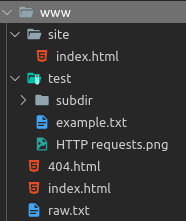

## Basic Functionality

Notice from the startup invocation that console messages are logged using the Python `logging.Logger` logging utility, which allows logging to a file (not implemented here) and logging to the console using different logging levels like DEBUG, INFO, WARN, ERROR, and CRITICAL.
Setting the `--verbose` commandline flag sets the log level to DEBUG.

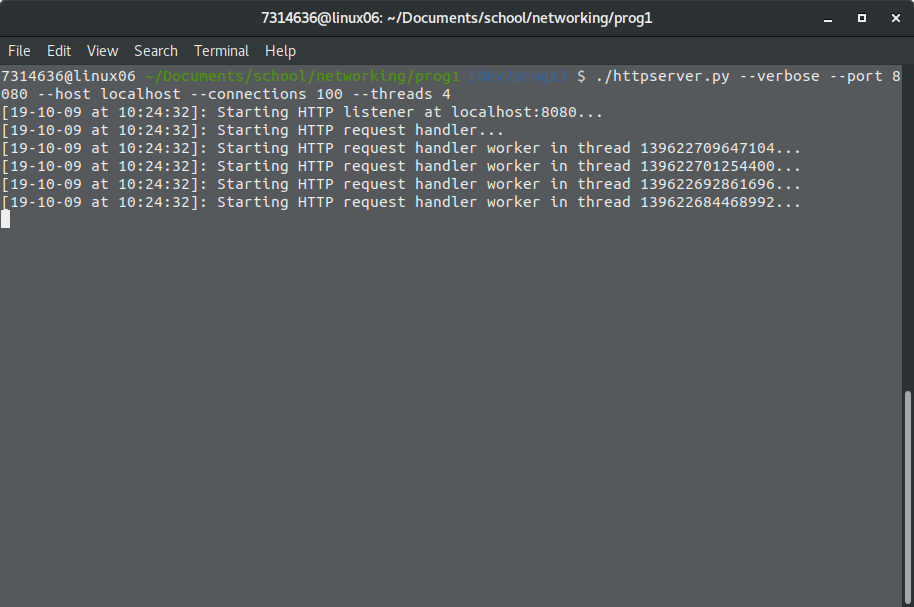

The HTTP server will log every request and the corresponding response, and if DEBUG logging is enabled, it will also print which thread is handling each response.

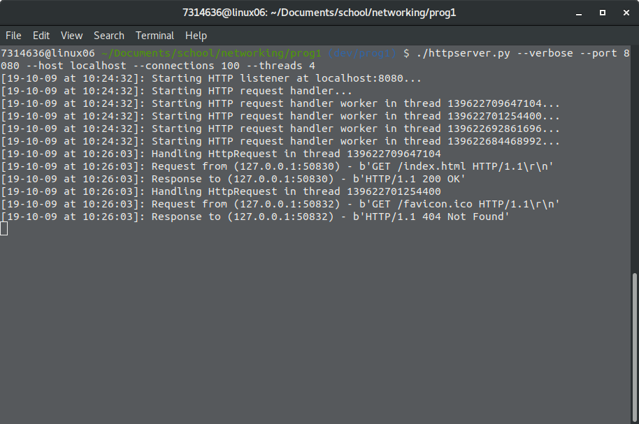

Firefox's developer tools can show the HTTP requests and responses for a page if they're open when you reload the page.
This is a useful debugging tool.

Notice from the following screenshot that the `Server` HTTP header has been set to `httpserver.py/0.1 (class project)`.
Notice also from the URL that the `index.html` page was explicitly requested.

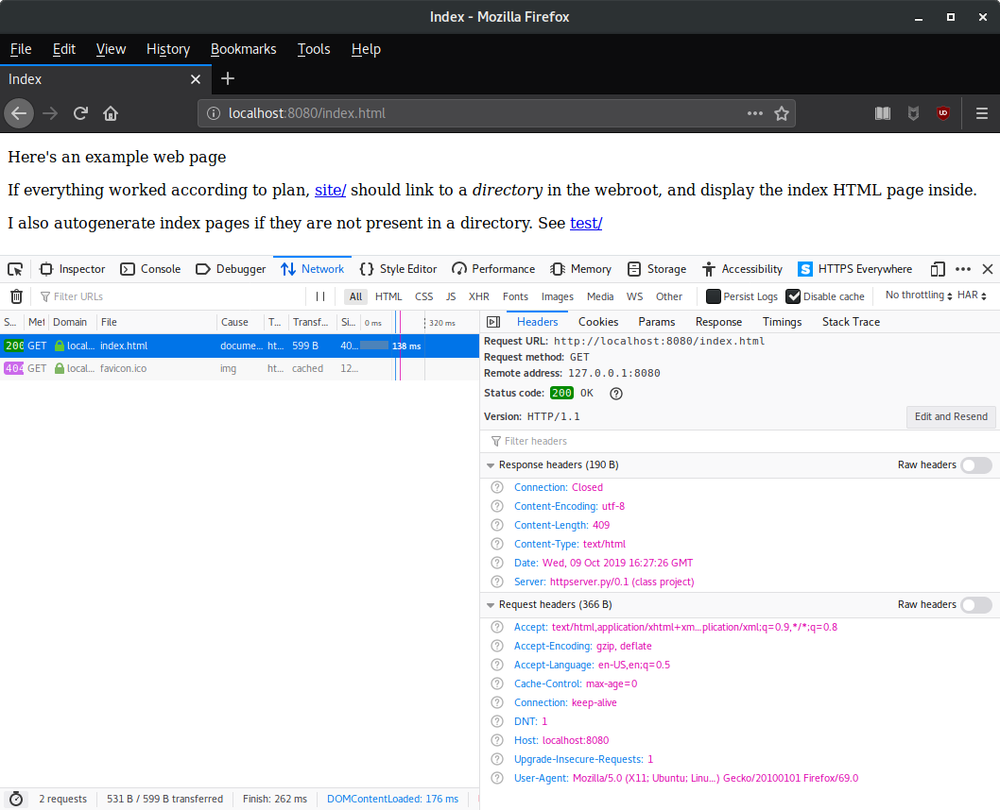

## Serving Directory Index Pages

If we request `localhost:8080/` instead of `localhost:8080/index.html`, it serves the same content as before.
This is because the HTTP server looks for `index.html` pages inside of directories.

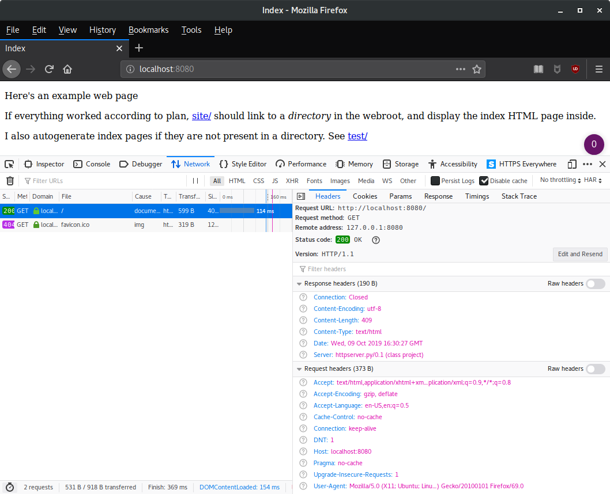

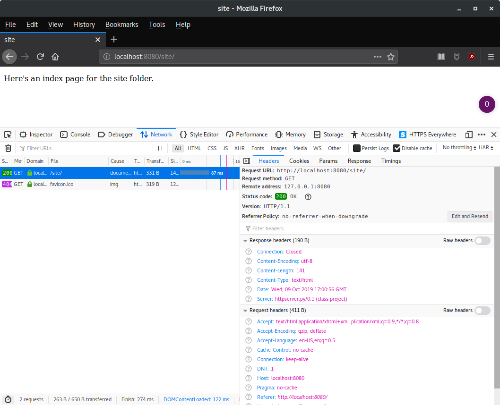

## Autogenerated Index Pages

If a directory does not have an `index.html` file, a default one will be generated.

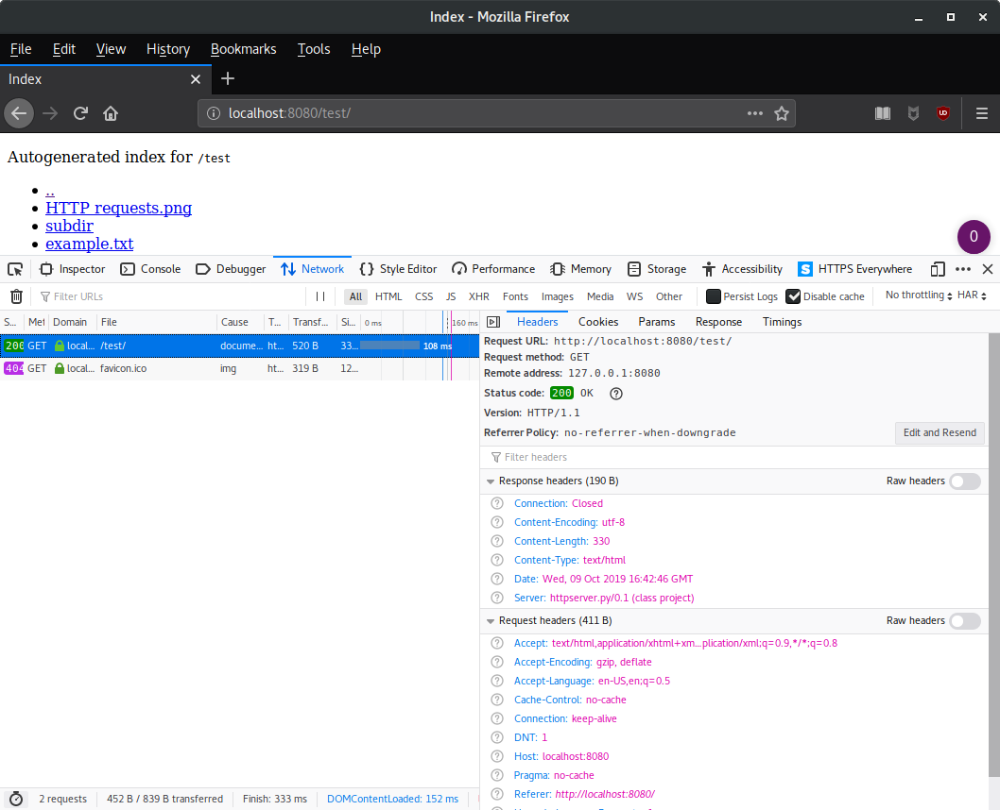

## Content MIME-Types

If the MIME type for a requested object can be determined, the `Content-Type` and `Content-Encoding` headers will be set accordingly.
Firefox uses the MIME type to determine how to render files.

For example, if a file has the plaintext MIME type, it will not be rendered, but instead displayed without formatting.

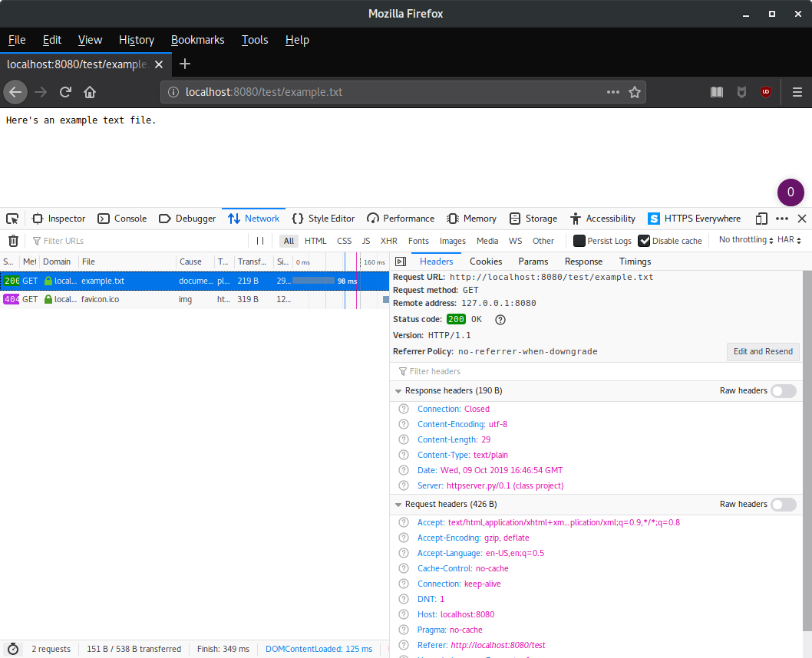

Files served with the markdown MIME type will not be rendered, but instead the user will be prompted to download the requested file.

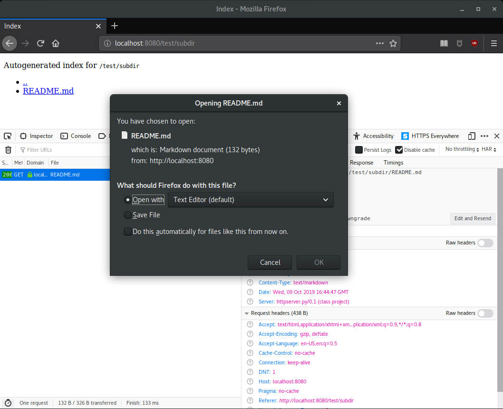

The HTTP server will even serve images.

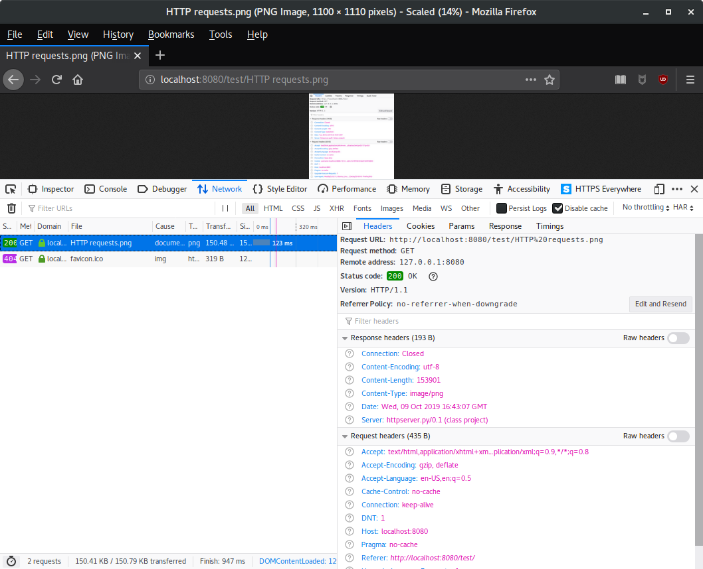

## Filenames with Spaces

Note from the above and below screenshots, that the HTTP server correctly handles filenames with spaces.
I do this through the `urllib.parse.unquote()` function from the Python standard library.

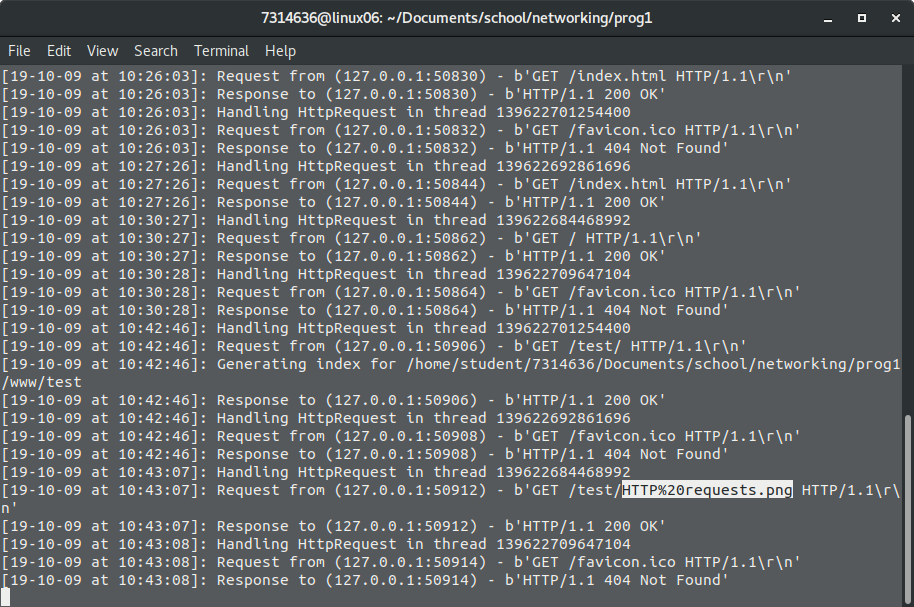
